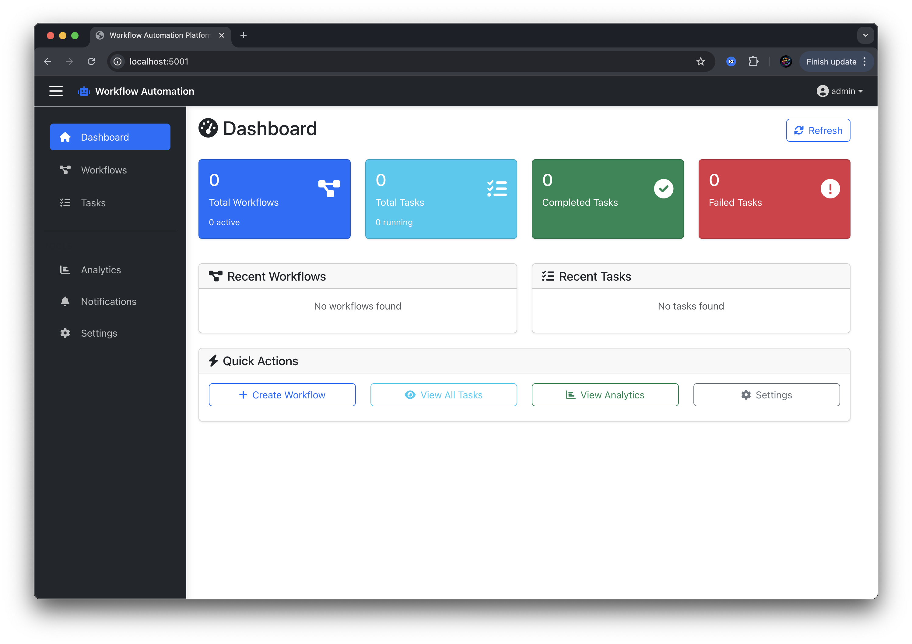
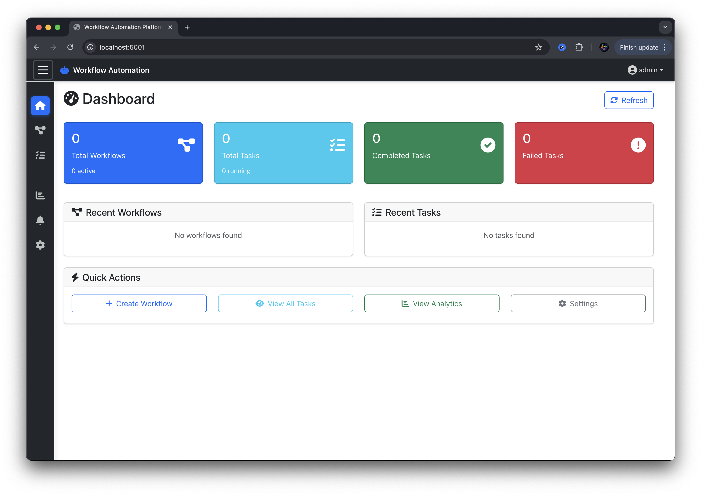
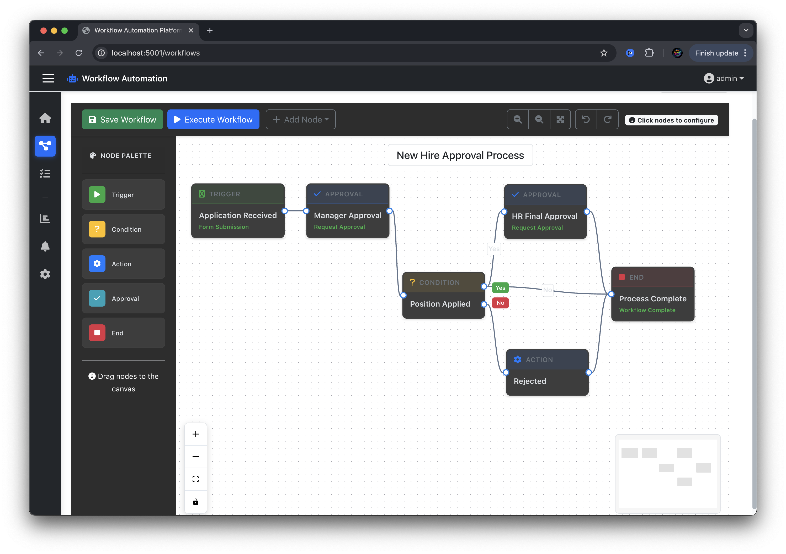
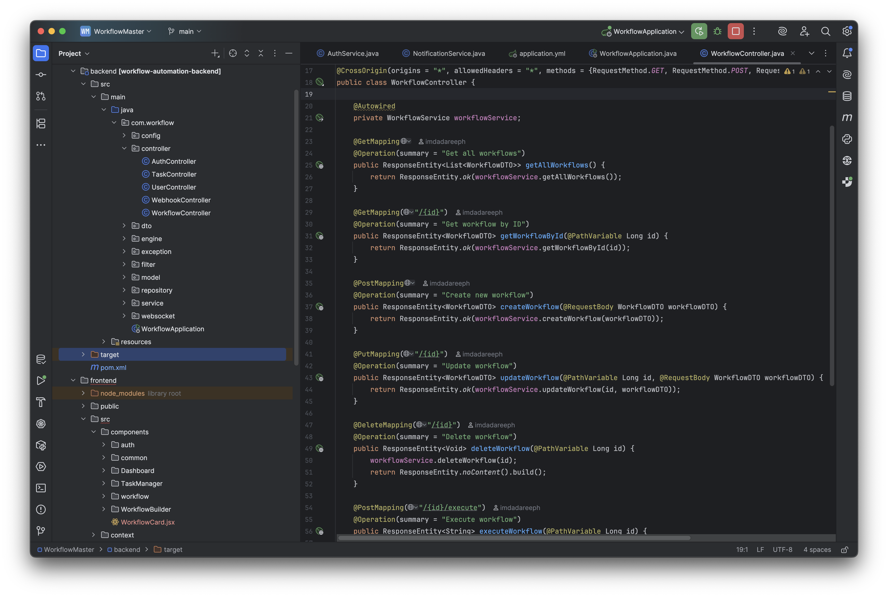
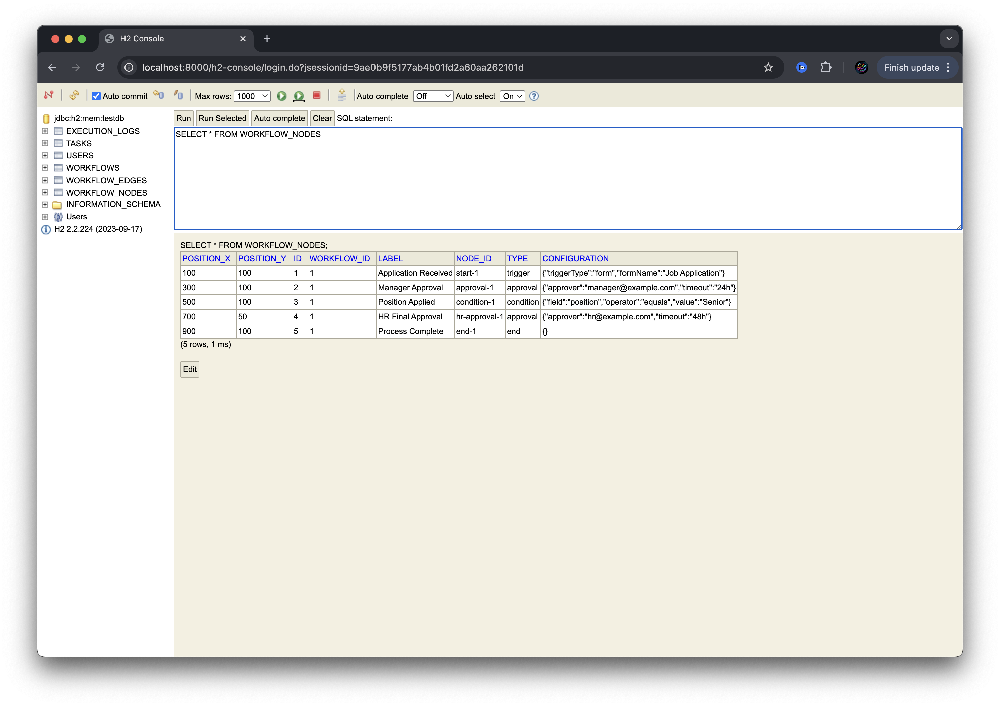
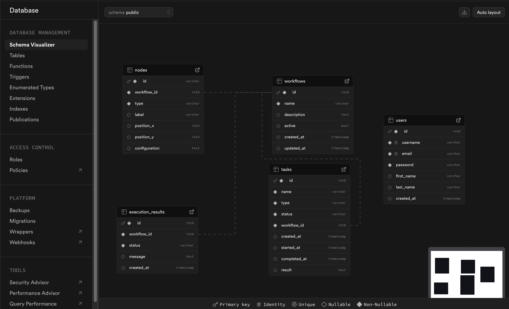

# Workflow Automation Platform

A comprehensive workflow automation platform built with Java Spring Boot backend and React frontend, featuring a visual drag-and-drop workflow builder using React Flow.

## 🚀 Features

### Core Capabilities
- **Visual Workflow Builder**: Drag-and-drop interface to create automation workflows
- **Real-time Monitoring**: Live workflow execution tracking with WebSocket updates
- **Multiple Node Types**: Triggers, conditions, actions, approvals, and end nodes
- **External Integrations**: Webhook support for n8n and other automation tools
- **User Management**: Authentication and authorization with JWT tokens
- **Task Scheduling**: Quartz scheduler for automated task execution
- **Database Support**: H2 for development, PostgreSQL/Supabase for production

### Backend (Java Spring Boot)
- **Workflow Engine**: Rule processing and task execution
- **REST API**: Comprehensive endpoints for workflow, task, and user management
- **WebSocket Support**: Real-time updates and notifications
- **Security**: Spring Security with JWT authentication
- **Database**: JPA/Hibernate with H2 (dev) and PostgreSQL (prod)
- **Email Notifications**: Configurable email service
- **Swagger Documentation**: Auto-generated API documentation

### Frontend (React + TypeScript)
- **Modern UI**: Bootstrap 5 with custom styling
- **Workflow Visualization**: React Flow for interactive workflow canvas
- **Real-time Updates**: WebSocket integration for live updates
- **Responsive Design**: Mobile-friendly interface
- **State Management**: React Context for global state
- **Component Library**: Reusable UI components

## 🛠️ Tech Stack

### Backend
- **Framework**: Spring Boot 3.x
- **Security**: Spring Security + JWT
- **Database**: Spring Data JPA + Hibernate
- **Scheduler**: Quartz Scheduler
- **WebSocket**: Spring WebSocket
- **Documentation**: Swagger/OpenAPI 3
- **Build Tool**: Maven
- **Java Version**: 17+

### Frontend
- **Framework**: React 18 with TypeScript
- **Build Tool**: Vite
- **Workflow Visualization**: React Flow
- **UI Framework**: Bootstrap 5
- **Styling**: Custom CSS + Tailwind CSS (optional)
- **HTTP Client**: Axios
- **Routing**: React Router
- **State Management**: React Context

### Database
- **Development**: H2 (in-memory)
- **Production**: PostgreSQL via Supabase

## 🚦 Getting Started

### Prerequisites
- Java 17 or higher
- Node.js 16+ and npm/yarn
- Maven 3.6+
- PostgreSQL (for production) or use provided H2 database

### Backend Setup

1. **Clone the repository**
   ```bash
   git clone <repository-url>
   cd workflow-automation-app/backend
   ```

2. **Configure database** (Optional - H2 is pre-configured)
   ```bash
   # For production, set environment variables:
   export DATABASE_URL=jdbc:postgresql://localhost:5432/workflow_db
   export DATABASE_USERNAME=your_username
   export DATABASE_PASSWORD=your_password
   ```

3. **Run the application**
   ```bash
   mvn spring-boot:run
   ```

   The backend will start on `http://localhost:8000`

4. **Access API documentation**
   - Swagger UI: `http://localhost:8000/swagger-ui.html`
   - H2 Console: `http://localhost:8000/h2-console` (dev only)

### Frontend Setup

1. **Navigate to frontend directory**
   ```bash
   cd ../frontend
   ```

2. **Install dependencies**
   ```bash
   npm install
   # or
   yarn install
   ```

3. **Start development server**
   ```bash
   npm run dev
   # or
   yarn dev
   ```

   The frontend will start on `http://localhost:5000`

### Default Login Credentials
- **Username**: `admin`
- **Password**: `admin123`

## 📁 Project Screenshot












